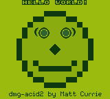
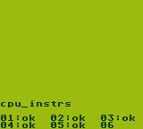

# 🎮 ferrisboy

A **Game Boy (DMG) emulator** written from scratch in safe, dependency-free Rust. The same emulator core runs as a **native macOS app** and, compiled to **WebAssembly**, **in the browser** — load a `.gb` ROM and play, with video, sound, input, and battery saves.

<p align="center">
  
  &nbsp;&nbsp;
  
</p>
<p align="center"><em>Left: the <code>dmg-acid2</code> PPU conformance test, pixel-perfect. Right: Blargg's CPU test suite reporting all subtests OK.</em></p>

## Why this exists

Emulators are the same class of software as QEMU: a program that *impersonates* a piece of hardware so faithfully that software written for the real machine can't tell the difference. ferrisboy rebuilds the Game Boy's CPU, memory bus, LCD, sound chip, and cartridge mappers in software, then runs unmodified commercial ROMs against them.

It's built to be **correct first** — validated against the same hardware test ROMs (Blargg, dmg-acid2) that real-hardware reverse-engineers use — and **portable second**: a pure-logic core with zero I/O dependencies, wrapped by thin platform frontends.

## Accuracy

Verified against the standard Game Boy test-ROM suites:

| Test suite | What it checks | Result |
|---|---|---|
| **Blargg `cpu_instrs`** | Every CPU instruction & flag | ✅ **11 / 11 pass** |
| **Blargg `instr_timing`** | Instruction cycle timing | ✅ **pass** |
| **`dmg-acid2`** | Background, window, sprites, priorities, OAM | ✅ **pass** (pixel-correct) |
| **Blargg `dmg_sound`** | All four sound channels & registers | ✅ **pass** |
| Blargg `mem_timing` | Sub-instruction memory timing | ⚠️ not targeted (see *Limitations*) |

## Features

- **Full Sharp LR35902 CPU** — all 256 + 256 (CB-prefixed) opcodes, exact flags, interrupts, the `EI` delay, and the `HALT` bug.
- **Scanline PPU** — background, window (with its own line counter), and sprites with the 10-per-line limit, X/OAM priority, 8×16 mode, flips, and OBJ-to-BG priority; STAT/LYC and VBlank interrupts.
- **4-channel APU** — two square channels (sweep + envelope), wave, and noise, mixed and resampled to 44.1 kHz stereo `f32`.
- **Cartridge mappers** — no-MBC, MBC1, MBC2, MBC3, MBC5, with banked external RAM and **battery-backed saves**.
- **Two frontends from one core** — a native window (minifb + cpal) and a WebAssembly build (canvas + Web Audio).
- **Safe Rust** — no `unsafe` in the emulator core, which is also **dependency-free** (the entire `core` crate has zero third-party dependencies).

## Run it

### Native (macOS / Linux / Windows)

```sh
# Play a ROM
cargo run --release -p ferrisboy-desktop -- path/to/game.gb

# …or launch with no argument to get a file picker
cargo run --release -p ferrisboy-desktop
```

**Controls:** Arrow keys = D-pad · `Z` or `Space` = A (jump/confirm) · `X` = B · `Enter` = Start · `Shift` = Select · `P` = cycle palette (green / pocket / grayscale / dusk) · `Esc` = quit.
Battery saves are written next to the ROM as `<rom>.sav`. (Click the window first so it has keyboard focus.)

> On a Game Boy, "jump" isn't a dedicated key — it's the **A** button, and each game decides what A does. The D-pad's *up* is for climbing/menus, which is why Up doesn't jump. Mapping `Z`/`X` to A/B is the standard Game Boy-emulator convention; `Space` is added as a friendlier A.

### Browser (WebAssembly)

```sh
# One-time: install the wasm bundler
cargo install wasm-pack

# Build the wasm module
wasm-pack build web --target web --out-dir pkg --release

# Serve it (ES modules + wasm need HTTP, not file://)
cd web && python3 -m http.server 8080
# open http://localhost:8080  →  drag a .gb ROM onto the page
```

Saves persist automatically to the browser's `localStorage`. Same controls as above.

> **ROMs are not included.** ferrisboy ships with no copyrighted games. Use homebrew ROMs or games you legally own. The test ROMs used for verification are fetched separately via `scripts/fetch-resources.sh`.

## Architecture

```
ferrisboy/
├── core/        ferrisboy-core — the emulator, pure logic, zero deps, no_std-friendly
│   └── src/
│       ├── cpu/       LR35902: opcode tables (mod.rs) + ALU/flags (alu.rs) + registers
│       ├── mmu.rs     the bus — routes every address to the right component
│       ├── ppu.rs     LCD: background / window / sprites → framebuffer
│       ├── apu.rs     4 sound channels → resampled stereo stream
│       ├── cartridge.rs   header parse + MBC1/2/3/5 banking + battery RAM
│       ├── timer.rs   DIV / TIMA with falling-edge increment
│       ├── joypad.rs · serial.rs · interrupts.rs
│       └── lib.rs     the public API: GameBoy::{new, run_frame, framebuffer, set_button, take_audio, save_data}
├── desktop/     ferrisboy-desktop — native window + keyboard + audio (minifb, cpal, rfd)
├── web/         ferrisboy-web — wasm-bindgen + canvas + Web Audio
└── core/examples/run_rom.rs   headless test harness (serial capture + PNG dump)
```

The frontends never touch the Game Boy internals: they call ~8 public methods on `GameBoy`. Because the core does no I/O, **the identical core compiles unchanged for native and `wasm32`**.

See [`docs/ARCHITECTURE.md`](docs/ARCHITECTURE.md) for the design and the emulation timing model.

## How it's tested

The core is verified headlessly — no window required — by `core/examples/run_rom.rs`, which boots a ROM, captures the serial port (where Blargg's ROMs print results), and can dump the framebuffer to PNG for visual diffing:

```sh
# CPU conformance — prints "Passed"
cargo run -p ferrisboy-core --example run_rom -- \
  test-roms/blargg/cpu_instrs/cpu_instrs.gb --until-serial --serial

# PPU conformance — writes a PNG you can compare to the reference
cargo run -p ferrisboy-core --example run_rom -- \
  test-roms/dmg-acid2.gb --frames 120 --png acid2.png
```

`cargo test` runs the APU unit tests. `scripts/fetch-resources.sh` downloads the test ROMs.

## Limitations (honest list)

- **DMG only** — original Game Boy. No Game Boy Color (CGB) modes yet.
- **Instruction-stepped timing** — peripherals advance once per CPU instruction, not per memory access. This passes `cpu_instrs`, `instr_timing`, `dmg-acid2`, and runs commercial games correctly, but not the sub-instruction `mem_timing` suite.
- **Mappers** — MBC1/2/3/5 are supported; MBC3's real-time clock registers are accepted but not ticked. MBC6/MBC7/HuC are not supported.
- No link-cable networking; no save states (battery RAM persistence only).

## Credits

- [Pan Docs](https://gbdev.io/pandocs/) — the community Game Boy hardware reference.
- [gbdev opcode table](https://gbdev.io/gb-opcodes/Opcodes.json) — machine-readable opcode data used to generate the decoder.
- **Blargg** — the `cpu_instrs` / `instr_timing` / `dmg_sound` test ROMs.
- **Matt Currie** — the [`dmg-acid2`](https://github.com/mattcurrie/dmg-acid2) PPU test.

## License

MIT — see [`LICENSE`](LICENSE).
